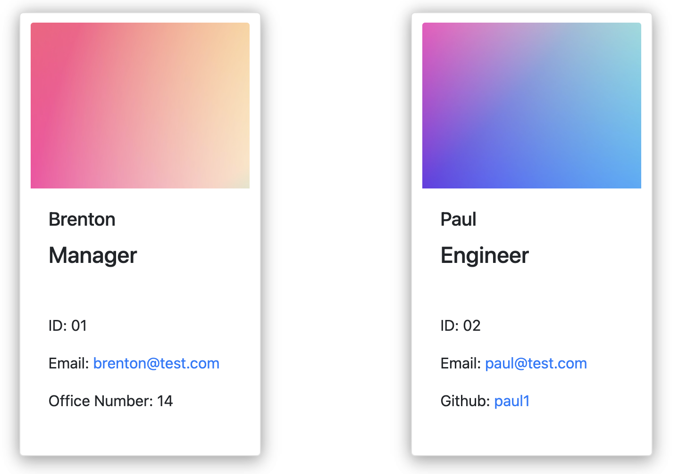
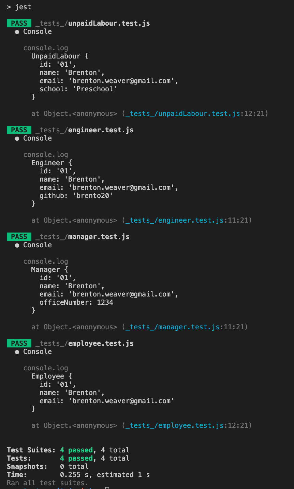

# Team Profile Generator
<br />
## Application Description

This application runs using node js and creates a html file containing employee profiles for a organization. 

The way I chose to highlight roles was with the role name title instead of an icon, and with a colorful image in the employee card. I was kinda inspired by pantone colour swatches.

## LINK TO VIDEO


https://www.youtube.com/watch?v=NJ4bM5k2z3Q&ab_channel=BrentonWeaver


## User Story

```md
AS A manager
I WANT to generate a webpage that displays my team's basic info
SO THAT I have quick access to their emails and GitHub profiles
```

<br>

## installation

```md
- Clone Github Repo
- Install node js
- Install dependencies by running "npm install"
- Navigate to the directory containing index.js
- Run using "node index.js" or test classes using "npm test"
- Follow prompts to render  ../disp/index.html
```
<br>

## Check List:
|Description | Status |
|--|--|
| Command line works (lets start with some low expectations) | Done |
| Can add info for manager |Done|
| Can add as many employees as I want | Done|
| Classes work and add role |Done|
| HTML is rendered containing object data | Done |
| Elements in html are clickable |Done|
|||

<br>

# Directory Structure
I started with a directory structure that looks like the following example:

```md
__tests__/			// jest tests
  Employee.test.js
  Engineer.test.js
  Intern.test.js
  Manager.test.js
disp/               // rendered output (HTML) and CSS style sheet
lib/				// classes
src/				// template code for  html and images for manager,intern,engineer
index.js			// runs the application (none index.js)
```

## Using the command line/terminal 
(If needed please find the MP4 in the github repo ./readmeFiles/team profile generator.mp4)


## Launched employee cards/Jest test results.

This application includes `Employee`, `Manager`, `Engineer`, and `Intern` classes. The tests for these classes (in the `_tests_` directory) ALL pass.

